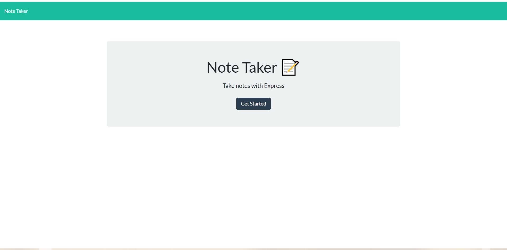
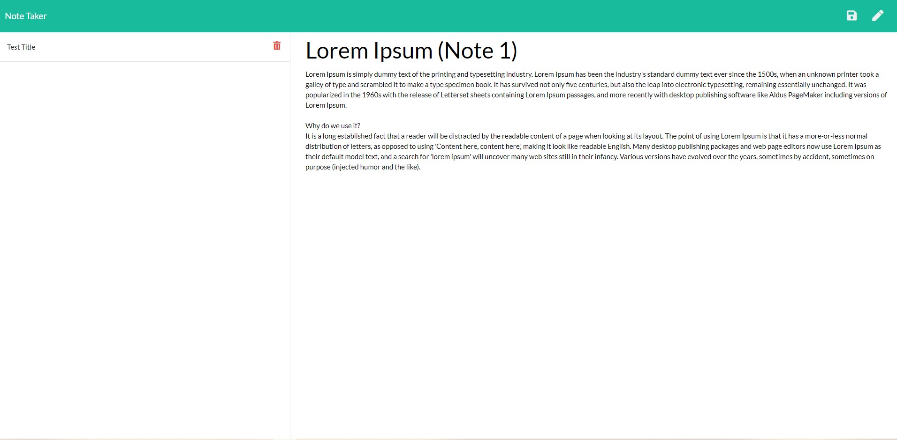
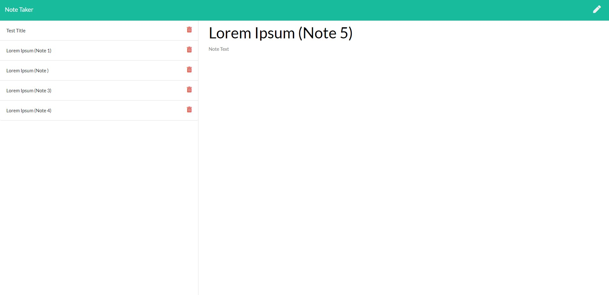

# Note Taker  [](https://opensource.org/licenses/MIT)

## Table of Contents
  * [Description](#Description)
  * [User Story](#User-Story)
  * [Contributors](#Contributors)
  * [Language/Technoligies Used](#Language/Technologies-Used)
  * [Mock-Up](#Mock-Up)    
  * [Repository](#Repository-Link)


## Description 
The purspose of this application is to help the user stay organized when entering notes. The note requirements are a title and a body. The user is able to save the notes and see the title of the notes on the row to the left. The notes are save in order from oldest(top) to newest(bottom). The user is also able to discart notes listed.

## User Story
```
AS A user, I want to be able to write and save notes

I WANT to be able to delete notes I've written before

SO THAT I can organize my thoughts and keep track of tasks I need to complete
```

## Contributors
Janneth Alvarado Verduzco - janneth_verduzco@live.com

## Language/Technologies Used
* HTML
* CSS
* JavaScript
* package.json- NPM package 
   * Express
   * UUID


## Mock-Up 

### Prompt Walkthrough


### Prompt Walkthrough


### Successful Written HTML


## Deployed Link (Heroku)
https://calm-crag-71296.herokuapp.com/

## Repository Link
https://github.com/jannverduzco/Team-Template-Generator